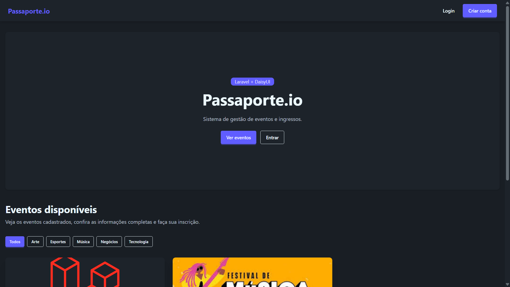
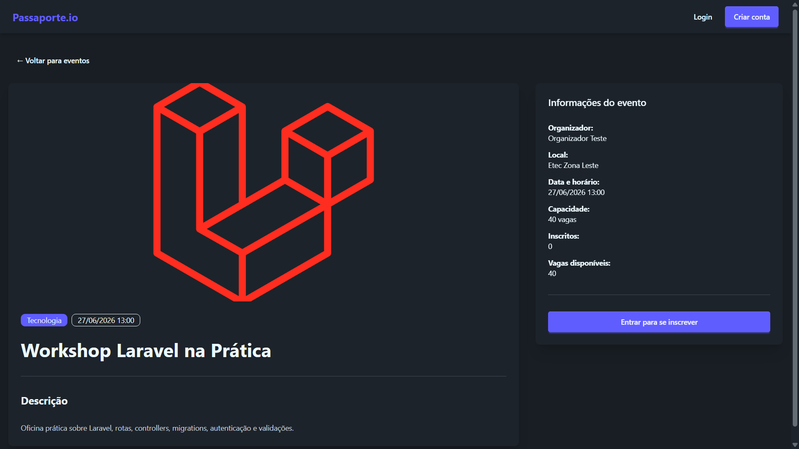
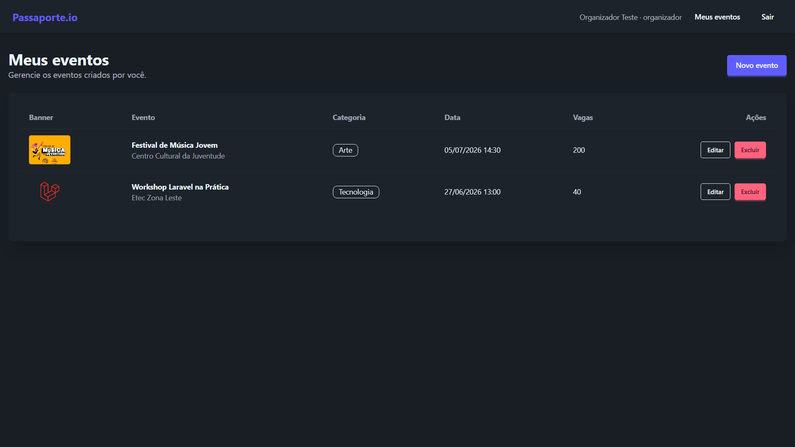
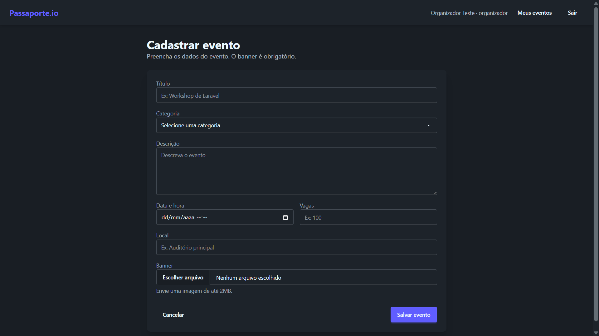
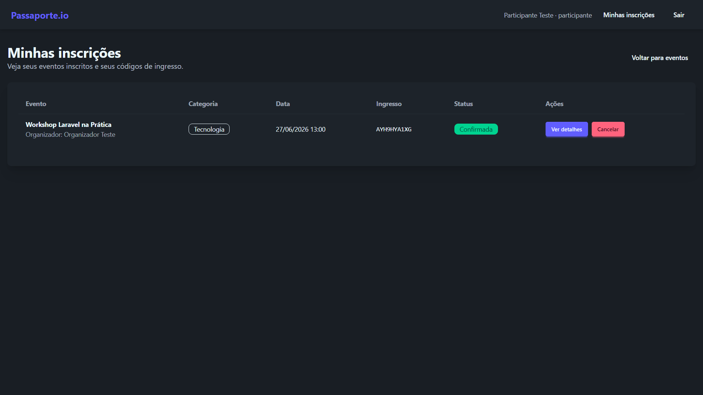

# Passaporte.io

Sistema web de gestão de eventos e ingressos desenvolvido com **Laravel** e **DaisyUI**.

O **Passaporte.io** é um MVP para gerenciamento de eventos, controle de inscrições e emissão de ingressos digitais. A aplicação possui uma vitrine pública para visualização dos eventos, uma área administrativa para organizadores e um fluxo de inscrição para participantes.

Repositório: https://github.com/Wallex-Andre/passaporte-io

---

## Informações acadêmicas

* **Matéria:** Programação Web III
* **Curso:** Desenvolvimento de Sistemas
* **Aluno:** Wallex André Adriano dos Santos

---

## Visão geral

O sistema foi desenvolvido para a atividade prática avaliativa **Passaporte.io**, com o objetivo de aplicar conceitos de autenticação, controle de acesso, relacionamentos Eloquent, validação de dados, upload de arquivos, migrations, seeders e organização de rotas em Laravel.

A aplicação possui três formas principais de acesso:

* **Visitante:** pode visualizar a vitrine pública, acessar detalhes dos eventos, cadastrar-se e fazer login.
* **Participante:** pode visualizar eventos, realizar inscrições, consultar ingressos e cancelar inscrições.
* **Organizador:** pode acessar a área administrativa e gerenciar seus próprios eventos.

---

## Demonstração

## Acesso online

O sistema também foi publicado na plataforma Railway, permitindo o acesso online ao projeto sem necessidade de instalação local.

**Link do projeto em produção:**

https://passaporte-io-production.up.railway.app

### Ambiente de produção

O deploy foi realizado utilizando:

* Railway para hospedagem da aplicação;
* MySQL no Railway como banco de dados;
* PHP 8.4;
* Node.js para build dos arquivos front-end;
* Laravel em ambiente de produção.

Durante a publicação, foram configuradas variáveis de ambiente para conexão com o banco de dados, URL da aplicação, chave da aplicação Laravel e ambiente de produção.

### Banco de dados em produção

O banco de dados MySQL foi configurado no Railway e as migrations foram executadas com seeders para criação das tabelas e dados iniciais do sistema.

Comando utilizado no ambiente de produção:

```bash
php artisan migrate:fresh --seed --force
```

Também foi verificado o link simbólico de armazenamento público:

```bash
php artisan storage:link
```

### Usuários para teste

O sistema possui usuários iniciais criados via seeder para facilitar a demonstração das funcionalidades.

**Organizador**

```txt
E-mail: organizador@passaporte.io
Senha: Passaporte@2026
```

**Participante**

```txt
E-mail: participante@passaporte.io
Senha: Passaporte@2026
```

### Observação sobre o ambiente online

A aplicação está hospedada em ambiente gratuito/temporário do Railway, portanto a disponibilidade pode depender dos limites da plataforma.


### Vídeo de apresentação

O vídeo apresenta o funcionamento geral do **Passaporte.io**, incluindo a vitrine pública, o painel do organizador, o fluxo de inscrição do participante e os principais trechos do código.

[](https://drive.google.com/file/d/1SG6qLDPATH5HhQK24sh0ofvEAEXH740M/view?usp=sharing)

> Clique na imagem acima para assistir ao vídeo de demonstração do projeto.

### Prints do sistema

#### Vitrine pública de eventos



#### Página de detalhes do evento



#### Área do organizador



#### Formulário de cadastro de evento



#### Minhas inscrições



---

## Tecnologias utilizadas

* PHP
* Laravel
* Composer
* MySQL
* Blade
* DaisyUI
* Tailwind CSS
* Eloquent ORM
* Laravel Migrations
* Laravel Seeders
* Laravel Storage

---

## Funcionalidades implementadas

### Visitante

* Visualização da vitrine pública de eventos.
* Filtro de eventos por categoria.
* Acesso à página de detalhes dos eventos.
* Cadastro de conta.
* Login no sistema.

### Participante

* Visualização de eventos disponíveis.
* Inscrição em eventos.
* Bloqueio de inscrição duplicada.
* Bloqueio de inscrição quando as vagas estão esgotadas.
* Consulta de inscrições realizadas.
* Visualização do código do ingresso.
* Cancelamento de inscrição.
* Acesso aos detalhes do evento pela tela de inscrições.

### Organizador

* Acesso à área administrativa.
* Cadastro de eventos.
* Edição de eventos próprios.
* Exclusão de eventos próprios.
* Bloqueio de edição ou exclusão de eventos de outros organizadores.
* Bloqueio de inscrição em eventos.

---

## Controle de acesso

O sistema utiliza middleware para controlar o acesso de acordo com o perfil do usuário.

| Funcionalidade                     | Visitante | Participante | Organizador |
| ---------------------------------- | --------: | -----------: | ----------: |
| Ver vitrine pública                |       Sim |          Sim |         Sim |
| Ver detalhes do evento             |       Sim |          Sim |         Sim |
| Criar conta                        |       Sim |          Não |         Não |
| Fazer login                        |       Sim |          Não |         Não |
| Inscrever-se em evento             |       Não |          Sim |         Não |
| Cancelar inscrição                 |       Não |          Sim |         Não |
| Acessar `/admin/*`                 |       Não |          Não |         Sim |
| Criar evento                       |       Não |          Não |         Sim |
| Editar próprio evento              |       Não |          Não |         Sim |
| Excluir próprio evento             |       Não |          Não |         Sim |
| Editar/excluir evento de terceiros |       Não |          Não |         Não |

---

## Principais regras de negócio

* O usuário pode se cadastrar como **participante** ou **organizador**.
* Participantes não podem acessar a área administrativa.
* Organizadores não podem se inscrever em eventos.
* O organizador só pode editar ou excluir eventos criados por ele.
* A data do evento deve ser futura.
* O banner do evento é obrigatório no cadastro.
* O banner deve ser uma imagem com tamanho máximo de 2MB.
* O participante não pode se inscrever duas vezes no mesmo evento.
* A inscrição é bloqueada quando a capacidade do evento é atingida.
* Cada inscrição gera um código único de ingresso.
* Eventos com inscrições ativas não podem ser excluídos.
* O e-mail do usuário deve ser único.
* O `user_id` do evento é definido pelo backend com base no usuário autenticado, sem depender de campo oculto no formulário.
* As senhas são armazenadas com hash.

---

## Requisitos funcionais atendidos

| Código | Requisito                          | Implementação                                                                 |
| ------ | ---------------------------------- | ----------------------------------------------------------------------------- |
| RF01   | Registro de novos usuários         | Cadastro com nome, e-mail, senha e perfil                                     |
| RF02   | Login                              | Autenticação por e-mail e senha                                               |
| RF03   | Logout                             | Encerramento seguro da sessão                                                 |
| RF04   | Listagem de eventos do organizador | Painel lista apenas eventos do usuário autenticado                            |
| RF05   | Criação de evento                  | Formulário com título, descrição, data, local, capacidade, categoria e banner |
| RF06   | Edição de evento                   | Organizador edita apenas seus próprios eventos                                |
| RF07   | Exclusão de evento                 | Exclusão bloqueada quando existem inscrições                                  |
| RF08   | Inscrição em evento                | Participante pode se inscrever em eventos disponíveis                         |
| RF09   | Geração de ingresso                | Cada inscrição recebe um `ticket_code` único                                  |
| RF10   | Histórico de inscrições            | Tela “Minhas inscrições”                                                      |
| RF11   | Cancelamento de inscrição          | Participante pode cancelar sua inscrição                                      |
| RF12   | Vitrine pública                    | Home com cards de eventos                                                     |
| RF13   | Filtro por categoria               | Filtro na vitrine pública                                                     |
| RF14   | Detalhes do evento                 | Página com banner, descrição, organizador, data, local e vagas                |

---

## Requisitos não funcionais atendidos

* Uso de migrations para criação das tabelas.
* Uso de seeders para dados iniciais.
* Uso de chaves estrangeiras para garantir integridade referencial.
* Relacionamento muitos-para-muitos entre participantes e eventos por meio da tabela `event_user`.
* Uso de campos extras na tabela pivô, como `ticket_code` e `status`.
* Uso de hash para armazenamento de senhas.
* Uso de CSRF nos formulários.
* Uso de validação nos dados recebidos pelos formulários.
* Uso de upload de imagem para banner do evento.
* Uso de paginação nas principais listagens.
* Uso de eager loading na vitrine pública para evitar o problema N+1.
* Uso de mensagens de feedback com componentes do DaisyUI.

Exemplo de eager loading utilizado na vitrine pública:

```php
Event::with(['category', 'user'])
```

---

## Critérios de aceite considerados

### CA01 — Controle de acesso

* Participantes são bloqueados em rotas administrativas.
* Organizadores são impedidos de realizar inscrições.

### CA02 — Validação do formulário de evento

O formulário rejeita:

* Título curto;
* Data retroativa;
* Banner acima de 2MB;
* Campos obrigatórios vazios.

As mensagens de validação são exibidas em português.

### CA03 — Banner e vínculo do evento

* O banner é salvo no storage público.
* O caminho do banner é armazenado no banco.
* O evento é vinculado ao organizador autenticado por `Auth::id()`.

### CA04 — Registro da inscrição

Ao realizar uma inscrição, o sistema cria um registro na tabela `event_user` contendo:

* `user_id`;
* `event_id`;
* `ticket_code`;
* `status`;
* `created_at`;
* `updated_at`.

### CA05 — Vitrine pública com eager loading

A página inicial carrega eventos com seus relacionamentos de categoria e organizador antes da renderização dos cards.

---

## Estrutura principal do banco de dados

### `users`

Armazena os usuários do sistema.

Campos principais:

* `id`
* `name`
* `email`
* `password`
* `role`
* `created_at`
* `updated_at`

Perfis aceitos:

* `participante`
* `organizador`

### `categories`

Armazena as categorias dos eventos.

Campos principais:

* `id`
* `name`
* `created_at`
* `updated_at`

### `events`

Armazena os eventos cadastrados pelos organizadores.

Campos principais:

* `id`
* `user_id`
* `category_id`
* `title`
* `description`
* `date_time`
* `location`
* `capacity`
* `banner_path`
* `created_at`
* `updated_at`

### `event_user`

Tabela pivô responsável pelas inscrições dos participantes nos eventos.

Campos principais:

* `id`
* `user_id`
* `event_id`
* `ticket_code`
* `status`
* `created_at`
* `updated_at`

---

## Relacionamentos Eloquent

* Um usuário organizador possui muitos eventos.
* Um evento pertence a um organizador.
* Uma categoria possui muitos eventos.
* Um evento pertence a uma categoria.
* Um participante pode se inscrever em vários eventos.
* Um evento pode ter vários participantes.
* A relação entre participantes e eventos é feita pela tabela pivô `event_user`.

A tabela pivô também armazena dados da inscrição, como o código do ingresso e o status.

---

## Rotas principais

| Método | Rota                         | Descrição                          |
| ------ | ---------------------------- | ---------------------------------- |
| GET    | `/`                          | Vitrine pública de eventos         |
| GET    | `/events/{event}`            | Detalhes do evento                 |
| GET    | `/register`                  | Tela de cadastro                   |
| POST   | `/register`                  | Criação de conta                   |
| GET    | `/login`                     | Tela de login                      |
| POST   | `/login`                     | Autenticação                       |
| POST   | `/logout`                    | Encerramento de sessão             |
| GET    | `/admin/events`              | Listagem de eventos do organizador |
| GET    | `/admin/events/create`       | Formulário de criação de evento    |
| POST   | `/admin/events`              | Cadastro de evento                 |
| GET    | `/admin/events/{event}/edit` | Formulário de edição de evento     |
| PUT    | `/admin/events/{event}`      | Atualização de evento              |
| DELETE | `/admin/events/{event}`      | Exclusão de evento                 |
| POST   | `/events/{event}/enroll`     | Inscrição em evento                |
| GET    | `/minhas-inscricoes`         | Histórico de inscrições            |
| DELETE | `/minhas-inscricoes/{event}` | Cancelamento de inscrição          |

---

## Organização do projeto

Principais arquivos e diretórios utilizados:

```txt
app/
├── Http/
│   ├── Controllers/
│   │   ├── AuthController.php
│   │   ├── EnrollmentController.php
│   │   ├── PublicEventController.php
│   │   └── Admin/
│   │       └── EventController.php
│   └── Middleware/
│       └── CheckRole.php
├── Models/
│   ├── User.php
│   ├── Event.php
│   └── Category.php

database/
├── migrations/
└── seeders/

resources/
└── views/
    ├── auth/
    ├── admin/
    │   └── events/
    ├── enrollments/
    ├── events/
    ├── layouts/
    └── home.blade.php

routes/
└── web.php
```

---

## Requisitos de ambiente

Para executar o projeto, é necessário ter instalado:

* PHP 8.2 ou superior;
* Composer;
* MySQL ou MariaDB;
* Git;
* Extensões PHP necessárias para Laravel;
* Servidor local compatível com Laravel.

---

## Como instalar e executar o projeto

### 1. Clonar o repositório

```bash
git clone https://github.com/Wallex-Andre/passaporte-io.git
```

### 2. Acessar a pasta do projeto

```bash
cd passaporte-io
```

### 3. Instalar as dependências

```bash
composer install
```

### 4. Criar o arquivo `.env`

No Windows:

```bash
copy .env.example .env
```

No Linux ou macOS:

```bash
cp .env.example .env
```

### 5. Gerar a chave da aplicação

```bash
php artisan key:generate
```

### 6. Configurar o banco de dados

Crie um banco de dados MySQL chamado:

```txt
passaporte_io
```

Configure o arquivo `.env`:

```env
DB_CONNECTION=mysql
DB_HOST=127.0.0.1
DB_PORT=3306
DB_DATABASE=passaporte_io
DB_USERNAME=root
DB_PASSWORD=
```

Caso seu MySQL tenha senha, preencha o campo `DB_PASSWORD`.

### 7. Executar migrations e seeders

```bash
php artisan migrate:fresh --seed
```

Esse comando cria as tabelas e popula os dados iniciais do sistema.

### 8. Criar o link simbólico do storage

```bash
php artisan storage:link
```

Esse comando permite que os banners enviados no cadastro de eventos sejam exibidos corretamente.

### 9. Iniciar o servidor local

```bash
php artisan serve
```

Acesse no navegador:

```txt
http://127.0.0.1:8000
```

---

## Dados criados pelos seeders

### Categorias

* Tecnologia
* Música
* Negócios
* Esportes
* Arte

### Usuários de teste

#### Organizador

```txt
E-mail: organizador@passaporte.io
Senha: Passaporte@2026
```

#### Participante

```txt
E-mail: participante@passaporte.io
Senha: Passaporte@2026
```

---

## Fluxo de teste recomendado

### Teste como organizador

1. Faça login com a conta de organizador.
2. Acesse a área do organizador.
3. Cadastre um novo evento.
4. Informe título, descrição, categoria, data futura, local, capacidade e banner.
5. Edite o evento cadastrado.
6. Tente excluir o evento.
7. Caso o evento possua inscrições, a exclusão deve ser bloqueada.

### Teste como participante

1. Faça login com a conta de participante.
2. Acesse a vitrine pública.
3. Filtre eventos por categoria.
4. Abra a página de detalhes de um evento.
5. Clique em “Inscrever-se”.
6. Verifique a mensagem de sucesso.
7. Acesse “Minhas inscrições”.
8. Confira o código do ingresso.
9. Acesse os detalhes do evento pela tela de inscrições.
10. Cancele a inscrição.

### Teste de regras de acesso

1. Faça login como participante e tente acessar uma rota iniciada por `/admin`.
2. O acesso deve ser bloqueado.
3. Faça login como organizador e acesse os detalhes de um evento.
4. O sistema deve impedir a inscrição de organizadores.
5. Tente realizar inscrição duplicada no mesmo evento.
6. O sistema deve bloquear a segunda inscrição.
7. Crie um evento com baixa capacidade e teste o bloqueio de vagas esgotadas.

---

## Comandos úteis

Listar rotas:

```bash
php artisan route:list
```

Recriar banco e popular dados:

```bash
php artisan migrate:fresh --seed
```

Limpar cache de configuração:

```bash
php artisan config:clear
```

Limpar caches gerais:

```bash
php artisan optimize:clear
```

Criar link do storage:

```bash
php artisan storage:link
```

Iniciar servidor:

```bash
php artisan serve
```

---

## Observações importantes

* O projeto não depende de dump `.sql`.
* A estrutura do banco é criada por migrations.
* Os dados iniciais são criados por seeders.
* Os formulários utilizam proteção CSRF.
* As senhas são protegidas com hash.
* Os banners são armazenados no storage público.
* A paginação foi aplicada nas principais listagens.
* A vitrine pública utiliza eager loading para evitar N+1.
* O campo `user_id` do evento é definido no backend, com base no usuário autenticado.

---

## Autor

Desenvolvido por **Wallex André Adriano dos Santos**.

Projeto avaliativo da matéria **Programação Web III**, do curso de **Desenvolvimento de Sistemas**.